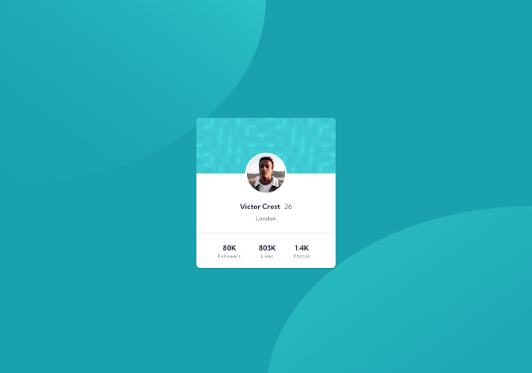

# Frontend Mentor - Profile card component solution

This is a solution to the [Profile card component challenge on Frontend Mentor](https://www.frontendmentor.io/challenges/profile-card-component-cfArpWshJ). Frontend Mentor challenges help you improve your coding skills by building realistic projects.

## Table of contents

- [Overview](#overview)
  - [The challenge](#the-challenge)
  - [Screenshot](#screenshot)
  - [Links](#links)
- [My process](#my-process)
  - [Built with](#built-with)
  - [What I learned](#what-i-learned)
  - [Continued development](#continued-development)
  - [Useful resources](#useful-resources)
- [Author](#author)
- [Acknowledgments](#acknowledgments)

## Overview

### The challenge

- Build out the project to the designs provided

### Screenshot



### Links

- Solution URL: [https://github.com/mays21/profile-card-component](https://github.com/mays21/profile-card-component)
- Live Site URL: [https://mays21.github.io/](https://mays21.github.io/)

## My process

### Built with

- Semantic HTML5 markup
- CSS custom properties
- Flexbox
- CSS Grid
- Mobile-first workflow

### What I learned

```css
background-image: url(../images/bg-pattern-top.svg), url(../images/bg-pattern-bottom.svg);
```

## Author

- Frontend Mentor - [@mays21](https://www.frontendmentor.io/profile/mays21)

## Acknowledgments

- 2 つの画像を重ねて表示する方法と位置の設定(2 種類)
- 1px 以下の太さの hr ライン
